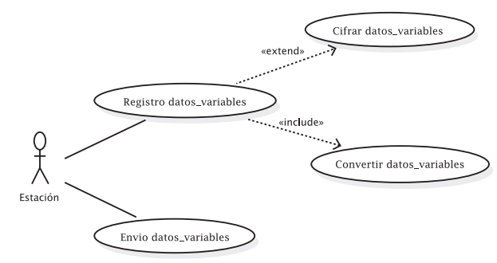

# 2. Semana 1

## 05/08/2023

### ¿Qué es el IoT?
En la actualidad, se habla de la industria 4.0, que son las industrias que se apoyan en las tecnologías actuales para optimizar sus procesos de producción.

Su principio se basa en 4 tecnologías:

- El internet de las cosas.
- Sistemas Ciberfísicos.
- Big Data.
- Inteligencia computacional.

El Internet de las cosas es la base para las demás tecnologías, inicialmente este termino fue usado para los sistemas electrónicos que usaban la tecnología RFID; sin embargo, con el avance de la tecnología y el uso de IoT, mostró su gran importancia para sectores como transporte, manufactura, agrícola, entre otros. El Internet de las Cosas busca la interconexión de objetos de la vida cotidiana por medio de una red de comunicación, como lo puede ser Internet.

El Internet de las Cosas busca la interconexión de objetos de la vida cotidiana por medio de una red de comunicación, como lo puede ser Internet. Su objetivo principal es la obtención de información relevante de los objetos y ambientes en los que estos se encuentran por medio de sensores. También envía información a través de Internet, ya sea para almacenarla en la nube o para el análisis de información de manera rápida, con el fin de tomar decisiones en tiempo real sobre procesos críticos.

Tomado de Freepik

Ventajas del Internet de las Cosas (IoT):

1. Conectividad permanente de objetos cotidianos a una red, capturando su información, lo que brinda la posibilidad de crear sistemas que funcionen en tiempo real y puedan operar de manera autónoma para la toma de decisiones inteligentes.
2. Permite generar alertas para uno o varios procesos que requieran intervención humana.
3. Involucra la participación de diversos sectores de la industria en pos del bienestar y la mejora de la calidad de vida de las personas.

### Histora del IoT

Eventos que han permitido o aportado en el desarrollo del paradigma de IoT:

- **1982** Máquina de Coca-Cola conectada con ARPNET.
- **1989** World Wide Web (WWW).
- **1990** Primera tostadora conectada a Internet.
- **1993** XCOFFEE, Cafetera que informa si hay cafe o no.
- **1994** WEARCAM, cámara portátil conectada a internet
- **1998** Introducción al IPv6.
- **1999** Aparece el termino Internet de las Cosas (IoT): fue usado por primera vez por Kevin Ashton ejecutivo de Auto-ID labs en el MIT.
- **2000** Internet digital Dios, LG anuncia un refrigerador con conexión a internet.
- **2004** El termino IoT se hace popular.
- **2005** NABAZTAG, pequeño robot conectado a internet.
- **2008** Este año se considera que nació el IoT debido al auge de dispositivos conectados.
- **2009** St. Jude Medical e IoT, Adaptador USB inalámbrico que recibía datos del implante cardiaco de un paciente.
- **2010** NEST COMPANY, compañía de electrodomésticos inteligentes.
- **2011** Gartner adiciona IoT al ciclo Hype
- **2014** Desarrollo de estánderes industriales, Intel, Cisco, IBM, GE, AT&T, se unen para mejorar la integración de IoT en la industria.
- **2015** Estándares globales en IoT.
- **2016** MIRAI, primer malware de IoT.
- **2017** Servicios de IoT.
- **2020** Ciclo Hype de IoT, se observa la madurez tecnológica de los subtemas de IoT y cuáles son los siguientes tópicos relevantes.

## 06/08/2023
### Etapas de una solución IoT
Para facilitar la creación de nuevas soluciones de IoT y seguir un orden lógico en el proceso de construcción y diseño, se proponen las siguientes etapas:

Etapas antes de la comercialización de IoT:

1. **Idea de implementación**:
Evaluar la posibilidad de implementar una solución IoT en tu empresa o en tus actividades diarias. Antes de comenzar, es importante preguntarse si ya existe una solución similar y qué ventajas ofrece.

2. **Selección de componentes y dispositivos intermedios**:
Considerar el rendimiento, consumo y precio de los componentes. El prototipo permitirá obtener una primera aproximación de la solución.

3. **Diseño de sistemas de comunicaciones**:
Integrar sistemas operativos que incluyan la capa de comunicaciones. La frecuencia, potencia y modo de operación son aspectos clave a tener en cuenta.

4. **Establecer infraestructura de comunicaciones e información**:
Esencial para estandarizar y establecer la conectividad entre diferentes dispositivos y protocolos de comunicación.

5. **Garantizar la seguridad de la aplicación**:
Proteger la integridad y confidencialidad de los datos, ya que esto es fundamental en las infraestructuras actuales de IoT.

6. **Implementar infraestructura y servicios en la nube**:
Proteger la integridad y confidencialidad de los datos, ya que esto es fundamental en las infraestructuras actuales de IoT.

7. **Desarrollar aplicaciones para el análisis de datos**:
Utilizar software y herramientas que incluyan funciones de aprendizaje automático y minería de datos, lo cual es crucial para la toma de decisiones en IoT.

8. **Diseñar una interfaz gráfica para el usuario**:
Permitir el acceso a la información de manera cómoda y sencilla, fomentando la interacción entre el usuario y el dispositivo.

9. **Crear software de gestión para aplicaciones**:
Este software regula el funcionamiento del dispositivo, incluyendo algoritmos de proceso, comunicación, sensorización, actuación y consumo energético.

10. **Seleccionar proveedores de servicios**:
Agregar valor a través de la conectividad y desarrollar nuevos servicios y soluciones en diversos entornos industriales.

11. **Desarrollar productos y soluciones verticales**:
Generar nuevos conocimientos y oportunidades para monetizar los datos de los dispositivos conectados mediante soluciones que transformen las organizaciones para el futuro.

### Lecturas complementarias
1. Texto sobre las diferencias entre el IoT y el IoT Industrial (IIoT).
[IIoT](https://www.hpe.com/lamerica/es/what-is/industrial-iot.html)

2. Arquitectura de dispositivos conectados a la nube.
[Cloud_Archicture](https://cloud.google.com/architecture/connected-devices?hl=es-419)

## 07/08/2023

### Aplicaciones Industriales

Para el entendimiento de las aplicaciones industriales, se realizó la lectura del texto 'El impacto de un nuevo paradigma tecnológico-social: el Internet de las cosas y la capacidad de innovación.

Dicho texto hace énfasis en el impacto que ha venido teniendo el IoT, en cómo cada vez hay más dispositivos conectados y cómo ello llevó a la aparición de métodos como la web semántica para que haya más capacidad de recibir datos y procesarlos, como lo hace el Big Data. También habla de los tres grandes bloques que estableció el Working Party 29 (WP29), quienes son los encargados de la seguridad de datos. Estos tres grandes bloques serían:

- Wearable Computing: Son dispositivos miniaturizados, de tal manera que se pueden llevar puestos y el cliente no los percibe. Por ejemplo, las gafas de Google (Google Glass), los smartwatches, entre otros.
- Dispositivos que registran información sobre la actividad de las personas, como lo es su estado de salud, actividad física, lugares visitados y con dicha información volcar los objetivos de venta, siempre y cuando dicha información no sea usada de forma incorrecta.
- Domótica: Por domótica se entiende el conjunto de tecnologías aplicadas al control y automatización inteligente de la vivienda.

Además de lo anterior, se habló de un producto lanzado por la empresa telefónica. Dicho producto se asemeja a unas piezas de Lego, las cuales se encajan entre sí, dándole así al cliente la libertad de armar sus propios sensores y que estos cumplan funciones deseadas. El objetivo es que el usuario pueda 'automatizar' su casa a gusto.

También se habla de 'Telepizza', el cual es un botón que se coloca en la nevera mediante un imán. Dicho botón está enlazado a la página web de la pizzería, donde el cliente crea su perfil, selecciona una pizza preferida y la vincula con el botón. De esta manera, el cliente solo necesitará pulsar el botón para que la pizza llegue a su casa, y la pizzería tendría un banco de información de sus clientes.

Por todo lo anterior y aunque los productos puedan parecer simples, se le da gran importancia a la capacidad de innovación que ha traído consigo el IoT, pues se ha producido una reconfiguración del conocimiento en un entorno dinámico y cambiante como lo es la tecnología. Y es que Internet es un impulsor de negocios que cuenta con una gran variedad de productos. A través de esta plataforma, en muchos casos se obtiene una comercialización de éxito, ya que abarata los costes de apertura y mantenimiento, lo que permite que el negocio sea más rentable para el emprendedor.

### Aplicaciones Agrícolas

Para el entendimiento de sus aplicaciones agrícolas, se hace uso de un paper desarrollado en la Universidad de Córdoba, el cual habla de sistemas IoT para el cuidado y automatización de cultivos protegidos. En este proyecto tenían como motivación encontrar nuevas y mejores maneras de producción agrícola. Promover nuevos procesos y métodos más eficientes para el control de los cultivos, lograr mejor calidad y ahorrar insumos.

Aprovechar los sistemas de control para desarrollar un sistema IoT que permita un mejor monitoreo de los cultivos y que recolecte datos en tiempo real para verificar su estado, al mismo tiempo que se toman decisiones o se llevan a cabo acciones.

Se propuso entonces el siguiente proyecto con una arquitectura tipo Cliente-Servidor, que se compone de capas:

1. **Administración y Procesamiento de Capturas (Datos)**: Es responsable de recibir la información de cada sensor mediante el protocolo MQTT, el cual permite conexiones cableadas e inalámbricas. Existe una administración y procesamiento directo de datos por parte del servidor a través de una interfaz de gestión que recibe la información transmitida en el sistema. Estos procesos están establecidos como capas subyacentes a los procesos principales.

2. **Interfaz de Servicios al Cliente**: Es la encargada de recibir las peticiones del cliente en la web, que luego se envían a una capa subyacente encargada de la gestión y procesamiento de la petición. También se muestra información al cliente mediante HTTP.

3. **Administración y Gestión**: Esta capa está a cargo de la suscripción al broker por un cliente MQTT como Paho. Recibe los datos y se conecta con la base de datos para su almacenamiento, dependiendo de la variable que se esté administrando. Aquí, cada dato se procesa en una cadena determinada.

4. **Recuperación y Entrega de Información**: Esta capa está diseñada para recuperar y entregar información, dependiendo de las solicitudes y respuestas del usuario, así como de los sensores. De la misma manera, cuenta con algoritmos de recuperación de información para facilitar las consultas realizadas por los clientes.

El procesamiento es manejado por la estación, que es la parte del dispositivo encargada de la recolección, procesamiento y envío de la información leída a través de los diferentes sensores.

### Aplicaciones en Salud

Para este sector, se utiliza un proyecto de investigación de la Universidad del Rosario en compañía de otras instituciones y el Hospital Universitario Mayor de Méridi en Bogotá. Esto surge motivado por las estadísticas del Ministerio de Salud y Protección Social, según las cuales existe un porcentaje del 19,4% de lesiones reportadas debido al mal manejo que las instituciones de salud dan a los medicamentos.

La falta de control de variables como la temperatura y la humedad en el almacenamiento de los medicamentos está relacionada con la alteración de las propiedades químicas de los productos farmacéuticos.

El sistema implementado se basó en una arquitectura centralizada de IoT, que hace uso de protocolos MQTT (Message Queue Telemetry Transport) y HTTPS (Hypertext Transfer Protocol Secure). Estos protocolos permitieron la conexión de objetos a través de Internet para transmitir información, con el propósito de lograr una comunicación inteligente entre los objetos y el sistema central de información.

La implementación final del sistema de monitorización permitió obtener un registro continuo de las variables de temperatura y humedad, estableciendo alarmas dinámicas con la finalidad de identificar y alertar al personal responsable sobre comportamientos no deseados en el equipo de refrigeración. Esto logró optimizar el registro diario de temperatura y humedad, garantizando la trazabilidad del proceso.

El proyecto plantea una solución IoT que permita la supervisión y registro de las temperaturas y humedad de un equipo de refrigeración.

Dado que el dispositivo mantiene temperaturas entre 2 - 8 °C, se eligió el sensor SHT11 para controlar que la temperatura del dispositivo se mantuviera en este rango.

Se implementó un tipo de arquitectura centralizada: la función del Broker es garantizar la calidad de los datos adquiridos antes de ser publicados en la nube. Este proceso permite que si existe un error en la lectura del sensor o se produce alguna pérdida de datos, estos sean depurados y corregidos por el Broker antes de su posterior publicación en la nube.

El sensor se conecta a la tarjeta de desarrollo ESP8266, que se caracteriza por su conexión fácil y segura vía WiFi. Los datos se leen cada 8 segundos y se envían mediante MQTT al broker local, donde está implementado un Raspberry Pi 3 (una computadora compacta).

MySQL es un sistema de gestión de bases de datos. SSL es un certificado digital que autentica la identidad de un sitio web y habilita una conexión cifrada. API (Interfaz de Programación de Aplicaciones) se puede considerar como un contrato de servicios entre dos aplicaciones.

## 08/08/2023

### Arquitectura IoT

#### Que es una arquitectura:
Describe la interacción entre los componentes del sistema, por lo que permite representar de forma detallada los componentes de hardware, protocolos de comunicación y la interacción segura y eficiente con el software que interactúa con el cliente. A partir de lo expuesto, se presentan las arquitecturas y sus principales componentes para aplicaciones de Internet de las Cosas.

Requerimientos de una arquitectura IoT:
1. **Conectividad permanente**:
Dado que Internet de las Cosas (IoT) es una red de múltiples dispositivos conectados a internet, es indispensable mantener una conexión permanente entre dispositivos, además de tener alternativas para el respaldo de información en los casos en que esta conexión presente fallos.

2. **Gestión de los datos**:
Debe llevar a cabo una gestión adecuada de los datos, permitiendo una recolección eficiente de la información y estableciendo estrategias para el análisis automático de dicha información. Por último, en una arquitectura de IoT se deben establecer procedimientos que posibiliten la toma de decisiones basadas en la recolección y análisis de datos.

3. **Gestión de los dispositivos**:
Debe establecer estrategias para realizar configuraciones, actualizaciones, búsqueda y reporte de fallos de manera eficiente en todos los dispositivos interconectados.

4. **Escalabilidad**:
Debe permitir el registro, actualización y eliminación de dispositivos de manera fácil y rápida. Igualmente, debe establecer estrategias de gestión de red que permitan el envío y registro de información sin pérdidas considerables.

5. **Flexibilidad**:
Debe permitir la gestión de dispositivos sin importar el fabricante del dispositivo ni los protocolos de comunicación utilizados. Por lo tanto, debe establecer procedimientos que le permitan adaptarse a los cambios tecnológicos y a nuevos protocolos existentes.

6. **Seguridad**:
La seguridad en una arquitectura de Internet de las Cosas (IoT) es fundamental, por lo que se deben establecer estrategias de gestión de red utilizando protocolos de transferencia de información rápidos pero, al mismo tiempo, seguros.

Cabe aclarar que, aunque el requerimiento de seguridad esté al final, no significa que se pueda ignorar; al contrario, este componente de la arquitectura es una pieza clave en la actualidad, ya que son recurrentes los intentos de robo de información en una época en la que la información es el producto.

#### Capas en una arquitectura de IoT: 
Se definen las interacciones entre el hardware del sistema IOT con los dispositivos de red, protocolos de comunicacion y el software de interaccion con el usuario.

1. **Aplicación**:
En esta capa se encuentran las aplicaciones, generalmente interfaces, que se encargan de la interacción con el usuario final de la aplicación.

2. **Red**:
En esta capa se encuentran los dispositivos de red que se encargan de gestionar todo el tráfico de información a través de la red mediante protocolos como HTTP, RESTful, MQTT, CoAP.

3. **Percepción**:
En esta capa se encuentran las cosas (Things), también llamadas entidades u objetos, que se encargan de la recolección de información del entorno a través de sensores y de la interacción con el mismo mediante actuadores.

### Diseño de una solución IoT:

El diseño de una solución se compone de las siguientes 9 fases:

1. **Descripción del problema**:
    - ¿Qué problema voy a solucionar?
    - Alcance de la solución
    - Resultados esperados
    - Nombre de la aplicación

2. **Requerimientos**:
    - Son aquellas peticiones que realizan los clientes para el funcionamiento de su aplicación.
    - La abstracción del problema para su posterior implementación.

3. **Entidades (Variables)**:
    - Nombre: debe ser único.
    - Tipo: numérica, texto, booleana.
    - Rango: finito, determinado por los sensores.

4. **Servicios (Funciones)**:
    - Son aquellas acciones que nuestro sistema IoT realiza constantemente.
    - Por lo general, tienen retorno ya sea texto, numérico o booleano.
    - Se definen a partir de las abstracciones de los requerimientos iniciales.

5. **Eventos**:
    - Son lo que se ejecuta cuando alguna variable está fuera de sus parámetros establecidos.
    - Por lo general, los parámetros están definidos por los rangos de las entidades.
    - Estos pueden generar desde una alerta al usuario hasta el control de un actuador.

6. **Arquitectura**:
    - En la arquitectura centralizada, se posee una capa de depuración.
    - En la arquitectura distribuida, la depuración se realiza en los sensores o en el servidor, no como una capa extra.

7. **Protocolos**:
    - HTTP
    - CoAP
    - MQTT
    - Otros más

8. **Almacenamiento**:
    - Base de datos Relacionales (Maria DB)
    - Base de datos no relacionales (Firebase)

9. **Interfaz**:
    - Se define la manera en que se entregará la información y las soluciones. Normalmente, mediante gráficos.