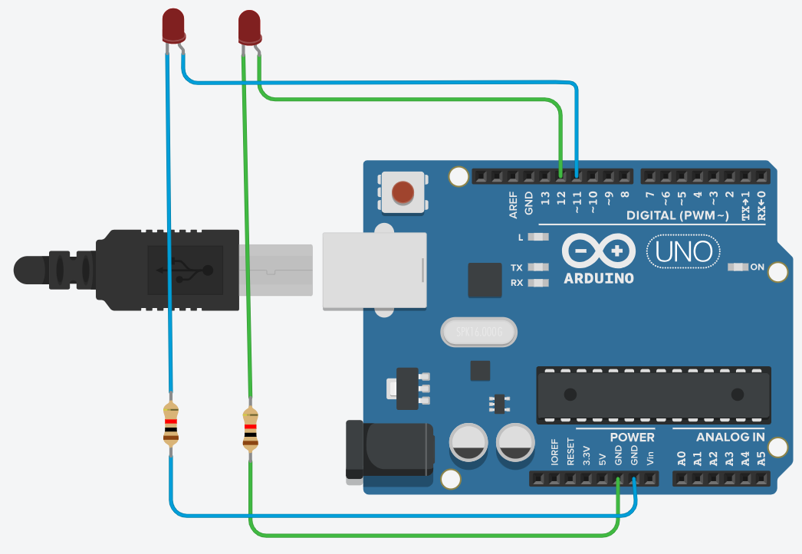
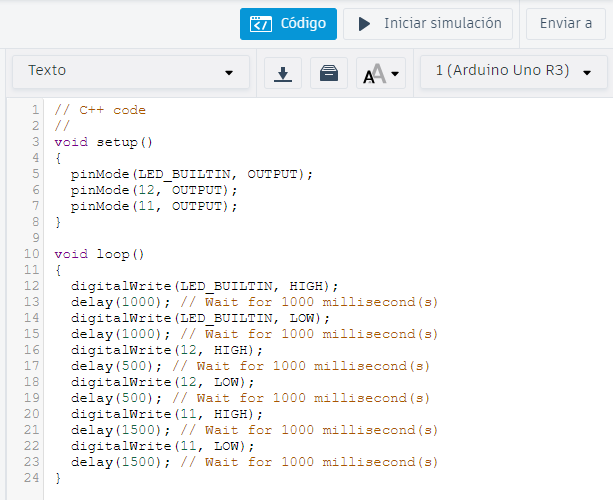

# 3. Semana 2

## 09/08/2023

### HardWare para IoT

#### ¿Qué herramientas se usan en el IoT?

- Sensores
- Actuadores
- Tarjetas de desarrollo, las cuales a su vez contienen microcontroladores y microprocesadores. Esto permite el control de sensores y actuadores mediante programación.
- Gestión de la conectividad mediante protocolos estandarizados como MQTT y HTTP, para asegurar que la información llegue a la nube de manera segura.
- Interfaz gráfica: comunica al usuario final la información entre los dispositivos (cosas) y la nube. Para ello, se utilizan aplicaciones de desarrollo alojadas en la nube.

Para entender estos componentes, inicialmente se hizo uso de Tinkercad, donde se permite simular tarjetas Arduino UNO, para así explicar un poco de la programación de estas y el entendimiento entre sensores digitales y analógicos.

#### Ejercicios Tinkercad
[Tinkercad](https://www.tinkercad.com/)

##### Ejercicio 1.
Encender dos LED alternandolos:

1. Crear un *sketch* de un **circuito**.
2. Arrastrar al *WorkSpace* un Arduino, dos LED y dos resistencias.
3. Conectar cada uno de los LED asignándole a cada uno un *pin* en el Arduino y la otra parte a una resistencia.
4. Conectar la resistencia al *Ground* del Arduino. Debería verse:
   
5. Con el montaje listo, ir al sector de código y cambiarlo de *Bloques* a *Texto*.
6. En el **Setup**, usando la función *pinMode*, asignarle a los LED el *pin* en el cual están conectados. (Incluir el LED propio del Arduino, **LED_BUILTIN**).
7. En el **Loop**, usando la función *digitalWrite*, encendemos o apagamos los LED y con *delay* agregamos un tiempo entre los pasos que va ejecutando Arduino. De esta forma, programamos un código que enciende un LED durante un segundo (1 seg), lo apaga, espera un segundo (1 seg), enciende el siguiente LED durante medio segundo (0.5 seg), lo apaga, espera otro medio segundo y finalmente enciende el LED restante durante un segundo y medio (1.5 seg), lo apaga y permanece apagado todo por otro segundo y medio (1.5 seg).
**Nota**: Recuerda que el delay se mide en milisegundos (1/1000 seg), por lo que un segundo sería *delay(1000);*.
   
8. Correr la simulación.