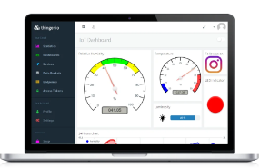

# Clase 10
## TI
### Dashboard
Un *Dashboard* para IoT es una herramienta de visualización de datos, la cual recolecta una colección de datos transmitidos por una red de dispositivos conectados; para transformalos, organizarlos y mostrarlos. El proposito principal de un Dashboard IoT es el de proveer información leible de un vistazo a el ser humano, es decir a el usuario, a traves de un monitor remoto donde se presente datos en tiempo real y/o un historial de datos.

### Diferentes aplicaciones de Dashboard
#### IOt Cloud de Arduino
El Arduino IoT Cloud es una plataforma fácil de usar, creada para *desarrolladores*, *integradores de sistema* y *para hobby*, la cual le permite al usuario manejar y desarrollar aplicaciones IoT que resuelvan problemas de la vida real en un ambiente laboral o de la vida cotidiana.

<iframe width="560" height="315" src="https://www.youtube.com/embed/hrwrhwFa74k?si=qpur68OwKOOPZ1oU" title="YouTube video player" frameborder="0" allow="accelerometer; autoplay; clipboard-write; encrypted-media; gyroscope; picture-in-picture; web-share" allowfullscreen></iframe>

#### Particle
Particle ofrece un desarrollador amplio como Arduino y una amplia nube de tipo desde el extremo hasta la nube para el manejo de dispositivos conectados. Puede trabajar gran cantidad de arreglos de tareas como lo es, el seguimiento de activos, el manejo de flotas de vehiculos (Trasnportes de alimento, buses, logistica, etc), mantenimiento predictivo, monitoreo ambiental, llenar ordenes en tiempo real y monitoreo y control remoto. 

<iframe width="560" height="315" src="https://www.youtube.com/embed/e_bpYI8MqBQ?si=RYbM6hnMNj1RZscM" title="YouTube video player" frameborder="0" allow="accelerometer; autoplay; clipboard-write; encrypted-media; gyroscope; picture-in-picture; web-share" allowfullscreen></iframe>

Las ventajas de esta plataforma son:
- Conectividad IoT a traves de Wi-Fi, celular y BLE de forma global en ,as de 150 paises
- Tiene un seguridad fuerte incluyen la encriptación de los dispositivos, autenticación PKI, inicio de sesión con protocolos robustos y controles de privacidad fuertes
- Cuenta con excelente escalabilidad, que incluye aprovicionamiento y escalamiento de dispositivos automatico.
- Una comunidad de ususarios grande y buenas capacidades de soporte

Las desventas son:
- La configuración es compleja, puede ser propensa a disrrupciones e interrupciones.
- Tiene un alto costo inicial y reduce de manera limitada los costos de operación y desarrollos
- Los usuarios se quejan de que la plataforma puede ser compleja

## TD

1. Preguntas sobre el tema de Dashboard
2. Elegir plataforma donde se desarrollara el Dashboard
3. Realizar una demostración de Dashboard
4. Ejercicios Individuales de Dashboard