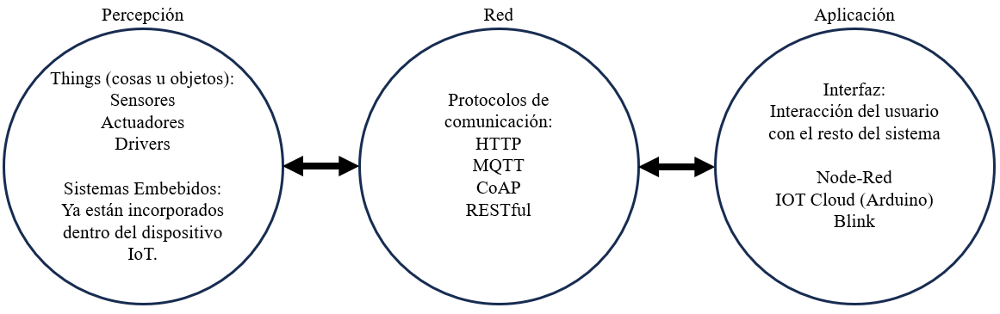

# Clase 3
## TI

### Arquitectura IoT

¿Qué es una arquitectura?

Describe la interacción entre los componentes del sistema, por lo que permite representar de forma detallada los componentes de hardware, los protocolos de comunicación y la interacción segura y eficiente con el software que interactúa con el cliente. A partir de lo expuesto, se presentan las arquitecturas y sus principales componentes para aplicaciones de Internet de las Cosas.

Requerimientos de una arquitectura IoT:

1. **Conectividad permanente**:
Al ser Internet de las Cosas una red de múltiples dispositivos conectados a Internet, es indispensable tener una conexión permanente entre dispositivos, además de tener alternativas para el respaldo de información en los casos en que esta conexión presente fallos.

2. **Gestión de los datos**:
Debe realizar una gestión adecuada de los datos, debe permitir una recolección de la información de forma eficiente y debe establecer las estrategias de análisis automático de la información. Por último, en una arquitectura de IoT se deben establecer procedimientos que permitan la toma de decisiones a partir de la recolección y análisis de la información.

3. **Gestión de los dispositivos**:
Debe establecer estrategias para realizar configuraciones, actualizaciones, búsqueda y reporte de fallos, de forma eficiente para todos los dispositivos interconectados.

4. **Escalabilidad**:
Debe permitir el registro, actualización y eliminación de dispositivos de manera fácil y rápida. De igual manera, debe establecer estrategias de gestión de red que permitan el envío y registro de información sin que existan pérdidas considerables.

5. **Flexibilidad**:
Debe permitir la gestión de dispositivos sin importar el fabricante del dispositivo y los protocolos de comunicación de éstos, por lo que debe establecer procedimientos que le permitan adaptarse a los cambios tecnológicos y nuevos protocolos existentes.

6. **Seguridad**:
La seguridad en una arquitectura de Internet de las Cosas (IoT) es fundamental, por lo que se deben establecer estrategias de gestión de red utilizando protocolos de transferencia de información rápidos, pero a su vez seguros.

### Capas en una arquitectura de IoT:
Las capas en una arquitectura definen las interacciones entre el hardware del sistema IoT con los dispositivos de red, protocolos de comunicación y el software de interacción con el usuario.
  
En la literatura se reportan arquitecturas de IoT hasta con siete o más capas; esto varía dependiendo del uso de la aplicación y protocolos de transferencias de información y seguridad que se requiera dependiendo el tipo de sistema IoT. Por lo tanto, una arquitectura de IoT tiene que ser escalable y flexible.

A continuación se expone la arquitectura de tres capas de IoT, es la base fundamental de las demás arquitecturas existentes.

1. **Aplicación**:
En esta capa se encuentran las aplicaciones, generalmente interfaces, que se encargan de la interacción con el usuario final de la aplicación.

2. **Red**:
En esta capa se encuentran los dispositivos de red que se encargan de gestionar todo el tráfico de información a través de la red mediante protocolos como HTTP, RESTful, MQTT, CoAP.

3. **Percepción**:
En esta capa se encuentran las cosas (Things), también llamadas entidades u objetos, que se encargan de la recolección de información del entorno a través de sensores y de la interacción con el mismo mediante actuadores.

### Diseño de una solución IoT:

El diseño de una solución se compone de las siguientes 9 fases:

1. **Descripción del problema**:
    - ¿Qué problema voy a solucionar?
    - Alcance de la solución
    - Resultados esperados
    - Nombre de la aplicación

2. **Requerimientos**:
    - Son aquellas peticiones que realizan los clientes para el funcionamiento de su aplicación.
    - La abstracción del problema para su posterior implementación.

3. **Entidades (Variables)**:
    - Nombre: debe ser único.
    - Tipo: numérica, texto, booleana.
    - Rango: finito, determinado por los sensores.

4. **Servicios (Funciones)**:
    - Son aquellas acciones que nuestro sistema IoT realiza constantemente.
    - Por lo general, tienen retorno ya sea texto, numérico o booleano.
    - Se definen a partir de las abstracciones de los requerimientos iniciales.

5. **Eventos**:
    - Son lo que se ejecuta cuando alguna variable está fuera de sus parámetros establecidos.
    - Por lo general, los parámetros están definidos por los rangos de las entidades.
    - Estos pueden generar desde una alerta al usuario hasta el control de un actuador.

6. **Arquitectura**:
    - En la arquitectura centralizada, se posee una capa de depuración.
    - En la arquitectura distribuida, la depuración se realiza en los sensores o en el servidor, no como una capa extra.

7. **Protocolos**:
    - *HTTP (Hypertext Transfer Protocol)*: Es el nombre dado a un protocolo que permite la petición de datos y recursos. Es la base para el intercambio de datos en la web.
    - *CoAP*: Es usado en dispositivos con recursos limitados (Sensores inalambricos). Este protocolo pretende replicar el modo de funcionamiento HTTP.
    - *MQTT (Message Queue Telemetry Transport)*: Es un protocolo de comunicación Maquina a Maquina (M2M, por sus siglas en ingles).
    - Otros más

8. **Almacenamiento**:
    - Base de datos Relacionales (Maria DB)
    - Base de datos no relacionales (Firebase)

9. **Interfaz**:
    - Se define la manera en que se entregará la información y las soluciones. Normalmente, mediante gráficos.

## TD

1. Resolver dudas y conversación sobre el TI

2. Apliación de la estructura IoT por parte del profesor:

    

3. Video de 6 min sobre la Arquitectura IoT de 4 capas (en ingles):

    

    

    

    <iframe style="position:absolute;top:0;left:0;bottom:0;right:0;" width="100%" height="100%" src="https://www.youtube.com/embed/fvabthY4Ejg?si=uip0eNH4cgm52eKK" frameborder="0" allow="accelerometer; autoplay; encrypted-media; gyroscope; picture-in-picture" allowfullscreen=""></iframe>
    

    

    

4. Para este TD los estudiantes pueden ir planeando con acompañamiento del profesor el proyecto de la materia aplicando lo aprendido sobre arquitectura IoT.
