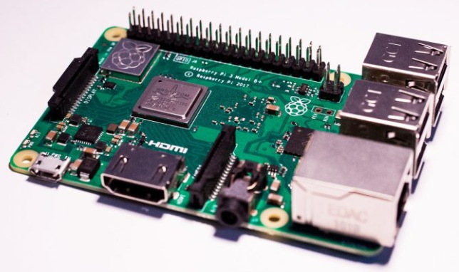
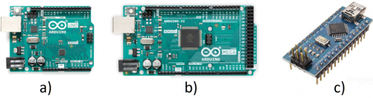

# Clase 4
## TI

### HardWare para IoT
¿Qué herramientas se usan en el IoT?

- Sensores
- Actuadores
- Tarjetas de desarrollo, las cuales tienen a su vez microcontroladores y microprocesadores. Lo cual permite el control de sensores y actuadores mediante programacion.
- Gestionar la conectividad mediante los protocolos estandarizados como lo son MQTT y HTTP, para asegurar que la informacion llegue a la nube de forma segura
- Interfaz grafica, comunica al usuario final la informacion entre las cosas y la nube, para ello se usan aplicaciones de desarrollo alojadas en la nube

#### Tarjetas de Desarrollo.

Una tarjeta de desarrollo es una herramienta que permite a un usuario la realización de diseño de prototipos tecnológicos, cuentan con una unidad principal de procesamiento de información, así como la integración, dentro del mismo dispositivo, de los elementos necesario para realizar diferentes y variados proyectos de desarrollo y de investigación.

Dentro de los componentes principales con los que estas placas cuentan están la memoria, el bus de comunicación, puertos de entrada y salida como unidades USB, Ethernet, pines de entrada y salida de propósito general (los cuales pueden ser digitales o analógicos), en algunos casos cuentan con comunicación vía Wi-Fi, y en casos más particulares cuentan con características especiales para la facilitación de su integración en sistemas IoT e Industria 4.0.

##### Raspberry Pi

Esta placa tiene gran popularidad hoy en día, es denominada como una computadora de placa reducida (SBC, por sus siglas en inglés), desarrollada en el Reino Unido por la Raspberry Pi Foundation. Nació con la intención de acercar a las personas al mundo de la informática, sin embargo, rápidamente se salió de ese enfoque y los usuarios la comenzaron a utilizar para el desarrollo tecnológico de toda índole.

Raspberry es completamente un computadora, teniendo todos los periféricos que cualquier PC casera contiene, incluyendo unidades de almacenamiento, la capacidad de poderse conectar a monitores, conexión de mouse y teclados, adicionalmente, funciona con diferentes sistemas operativos, el más popular Raspbian que es una versión de Debian.

A pesar de que originalmente no estaba diseñado para el desarrollo de prototipos, esta tarjeta ha adquirido gran popularidad en esta rama, convirtiéndose en el punto central de muchos proyectos de domótica, IoT, e industria 4.0, En la siguiente lectura se muestra un ejemplo de IoT usando una tarjeta Raspberry Pi.

<iframe src="../../img/An_IoT_based_patient_monitoring_system_using_raspberry_Pi.pdf" frameborder="0" width="100%" height="600px"></iframe>

##### Arduino

Probablemente la tarjeta más conocida a nivel mundial. Desarrollado en 2003 en el Instituto de Diseño Interactivo de Ivrea, Italia, con la intención de hacer fácil la programación y el diseño de prototipos. Su principal característica es que, aunque existe el proyecto Arduino de manera formal (https://www.arduino.cc/), y en su página se venden las placas “originales”, esta tarjeta está desarrollada bajo el concepto de software y hardware libre, lo que implica que cualquier persona puede replicar la tarjeta sin ninguna restricción.

Esta placa se ha popularizado en gran medida, debido a la facilidad con la que se pueden realizar proyectos académicos, técnicos y científicos, basta con teclear en cualquier buscador “Arduino proyectos” para que se despliegue una cantidad incontable de proyectos a realizar con la plataforma. Algunos detractores de esta herramienta, basan sus criticas precisamente en la facilidad con la que se puede programar la placa, sin embargo, hay que recordar que es precisamente esta facilidad la que ha acercado a millones de estudiantes, y personas en general, a nivel mundial al diseño ingenieril y que se pueden realizar proyectos tan complejos como al usuario se le ocurra. En la lectura a continuación se muestra un proyecto realizado haciendo uso de Arduino.

<iframe src="../../img/Arduino_based_temperature_and_humidity_control_for_condensation_on_wettability_engineered_surfaces.pdf" frameborder="0" width="100%" height="600px"></iframe>

## TD

1. Solción dudas del trabajo independiente

2. Descargar en conjunto a los estudiantes Arduino

3. Practicas en Arduino en clase.
    - Con la maqueta pequeña del semáforo:
        - Enunciado: Controlar un semáforo que funcione de la siguiente manera:

        *Modo día*: Enciende el bombillo rojo durante 3 segundos, luego aoaga el bombillo rojo y enciende el bombillo amarillo durante 1.5 segundos, apaga el bombillo amarillo y enciende el bombillo verde durante 4 segundos. Al terminar los 4 segundos apaga el bombillo verde y se repite el ciclo.

        *Modo noche*: Enciende y apaga el bombillo amarillo cada medio segundo.

        *Nota*: Simular el sensor de luz con un suiche.

4. Practica 2
    - Con la misma maqueta ahora los estudiantes deberan lograr controlar tanto el semaforo de carros como el de peatones. Que durante el semáforo de carros este en rojo el de peatones este en verde y cuando el de carros este en verde y amarillo el de peatones este en rojo.

    - Una vez lograda la tarea anterior, el estudiaante debera agregar los parpadeos de aviso del fin de la luz verde.