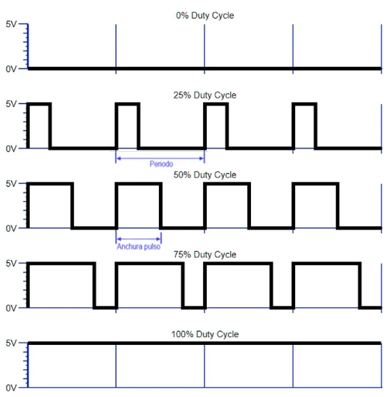
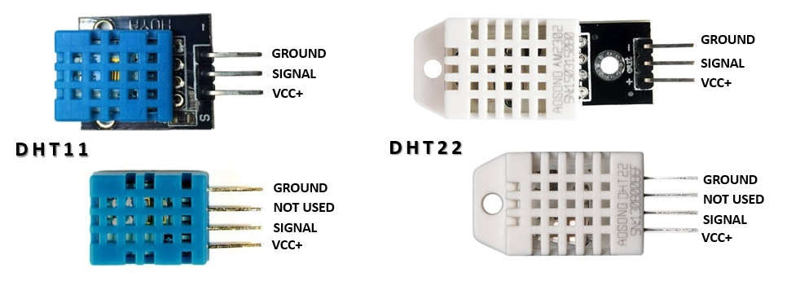
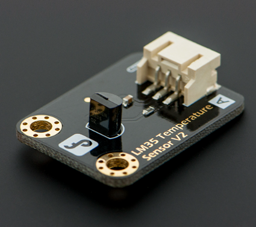
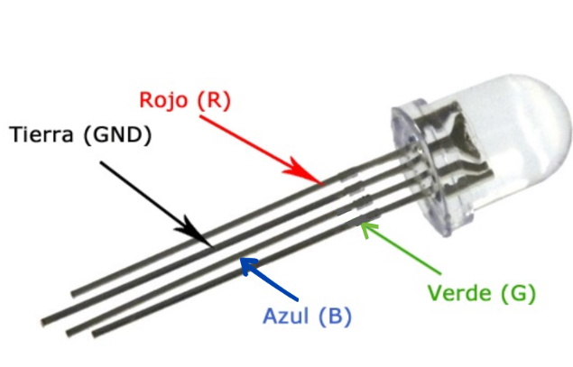

# Clase 5
## TI

### Sensores
¿Qué son los sensores?

Los sensores son objetos capaces de detectar magnitudes físicas o químicas, llamadas variables de instrumentación, y transformarlas en variables eléctricas. Las variables de instrumentación pueden ser por ejemplo: intensidad lumínica, temperatura, humedad, distancia, aceleración, pH, etc. Por otro lado una magnitud eléctrica puede ser una resistencia eléctrica, capacidad eléctrica, tensión eléctrica, corriente eléctrica, entre otros.

### Sensor analógico
Un sensor analógico es aquel que, como salida, emite una señal comprendida por un campo de valores instantáneos que varían en el tiempo, y son proporcionales al efecto que están midiendo; por ejemplo un termómetro es un dispositivo analógico. La temperatura se mide en grados que pueden tener, en cualquier momento un valor determinado, diferentes valores que son proporcionales a su indicador, o a su salida en caso de una dispositivo electrónico.

En otras palabras los sensores analógicos son aquellos que miden valores diferentes a 1 o 0. Temperatura, humedad, aceleración, velocidad, etc.

En Arduino estos sensores que trabajan con señal continua, sabiendo que Arduio trabaja con una corriente entre 0V y 5V, pueden tomar cualquier valor entre 0V y 5V.

Para estos sensores se necesitan conversores de analógicos - digital (ADC), las tarjetas de desarrollo Arduino cuentan con un ADC integrado de 10 bits osea 1024 valores que van de 0 a 1023, para adquirir la información del sensor se hace uso de la función <code>analogRead(PIN)</code>

### Sensor digital
Un sensor digital es un dispositivo que puede adoptar únicamente dos valores de salida; 1 o 0, encendido o apagado, sí o no. Los estados de un sensor digital son absolutos y únicos, y se usan donde se desea verificar estados de *verdadero* o *negación*. Por ejemplo en una banda transportadora hay un sensor de posición al final del recorrido, el cual esta en reposo (0), mientras no haya llegado la caja al final del recorrido y cambia inmediantamente a encendido (1) en cuanto la caja llega a él y el sistema realiza alguna acción basado en dicha condición.

En Arduino estos sensores que son absolutos solo podrían ser 0V o 5V, no un valor entre ellos, para su adquisición se hace uso de la función <code>digitalRead(PIN)</code>.

### Información extra
La universidad cuenta con tarjetas Arduino Mega 2560, las cuales poseen 16 canales de entrada, conversores análogos/digitales de 10 bits.

Un conversor ADC convierte la señal análoga en un número digital (binario), él cual es proporcional a la señal análoga. Esto quiere decir que si dividimos los 5V entre 1023 que son los valores de acuerdo al número de bits, siendo entonces 5V/1023 = 4.28 mV, entonces cuando la señal análoga sea 0V le corresponde el numero digital = 0000000000 y para 5V = 1111111111.

### PWM 
El Pulse Width Modulation (Modulación por ancho de pulso) es una técnica que se usa para transmitir señales analógicas cuya señal portadora será digital. En esta técnica se modifica el ciclo de trabajo de una señal periódica (una senoidal o una cuadrada, por ejemplo), ya sea para transmitir información a través de un canal de comunicaciones o para controlar la cantidad de energía que se envía a una carga. El ciclo de trabajo (duty cycle) de una señal periódica es el ancho de su parte positiva, en relación con el período. Está expresado en porcentaje, por tanto, un duty cycle de 10% indica que está 10 de 100 a nivel alto.

Duty cycle = t / T

t = tiempo en parte positiva

T = Periodo, tiempo total

Básicamente, consiste en activar una salida digital durante un tiempo y mantenerla apagada durante el resto, generando así pulsos positivos que se repiten de manera constante. Por tanto, la frecuencia es constante (es decir, el tiempo entre disparo de pulsos), mientras que se hace variar la anchura del pulso, el duty cycle. El promedio de esta tensión de salida, a lo largo del tiempo, será igual al valor analógico deseado.

El PWM tiene diferentes usos como lo es:
- cambiar intensidad lumínica de un LED, disponer de una salida analógica; si la salida digital está filtrada, esto proveerá de un voltaje entre el 0% y el 100%
- Generar señales de audio.
- Proveer de un control de velocidad variable para motores
- Generar una señal modulada, por ejemplo para utilizar un LED infrarrojo para control remoto.

### Algunos sensores existentes
#### DHT11/DHT22
Ambos son sensores de temperatura y humedad, una de las ventajas que nos ofrecen los sensores DHT, además de medir la temperatura y la humedad, es que son digitales. A diferencia de sensores como el LM35, este sensor utiliza un pin digital para enviarnos la información y por lo tanto, se produce menos ruido.

<table><tbody><tr><th>Modelo</th><th>DHT11</th></tr><tr><td>Alimentación</td><td>de 3,5 V a 5 V</td></tr><tr><td>Consumo</td><td>2,5 mA</td></tr><tr><td>Señal de salida</td><td>Digital</td></tr><tr><td><strong>Temperatura</strong></td><td>&nbsp;</td></tr><tr><td>Rango</td><td>de 0ºC a 50ºC</td></tr><tr><td>Precisión</td><td>a 25ºC&nbsp;± 2ºC</td></tr><tr><td>Resolución</td><td>1ºC (8-bit)</td></tr><tr><td><strong>Humedad</strong></td><td>&nbsp;</td></tr><tr><td>Rango</td><td>de 20% RH a 90% RH</td></tr><tr><td>Precisión</td><td>entre 0ºC y 50ºC ± 5% RH</td></tr><tr><td>Resolución</td><td>1% RH</td></tr></tbody></table>

#### LM35
Es un sensor de temperatura que lee entre -55°C a 150°C, donde 1°C equivale a 10 mV y soporta voltajes entre 4V y 30V. <a rel="noreferrer noopener" href="http://www.ti.com/lit/ds/symlink/lm35.pdf" target="_blank">Ficha técnica del LM35</a>. Entonces para calcular la temperatura en función del voltaje que facilita el LM35 es: Temperatura = Valor * 5 * 100 / 1024. Dos cosas a tener en cuenta son la utilización del monitor serie y de la función delay. El puerto serie nos permite ver el resultado de una forma rápida a través del entorno de desarrollo de Arduino.

#### LED RGB
Este tipo de diodos tienen en un mismo encapsulado un LED de cada uno de los colores básicos, rojo, verde y azul (Red, Green, Blue), de ahí su nombre, y comparten un cátodo común (Ground). Se pueden alimentar los 3 LEDs al mismo tiempo o generar todo tipo de combinaciones. Los Monitores o pantallas con LEDs utilizan LEDs RGB que actúan como píxeles, y dedicados controladores de video generan las combinaciones e intensidades adecuadas para darle a cada LED (píxel) la tonalidad y color correspondiente para generar en grupo la imagen que se ve. Por otro lado si energizamos cada LED con resistencias que son fijas, los colores serán fijos. Pero si utilizamos resistencias variables o un sistema modulador de ancho de pulsos (PWM para LEDs RGB) podremos atenuar o intensificar los colores combinando infinidad de tonalidades del rojo, verde y azul, barriendo prácticamente con toda la gama de colores.

## TD
1. Re alimentación del TI
2. Leer la temperatura desde el sensor LM35
3. Agregar la libreria DHT a Arduino para realizar la lectura de temperatura y humedad
4. Jugar con el bombillo LED RGB