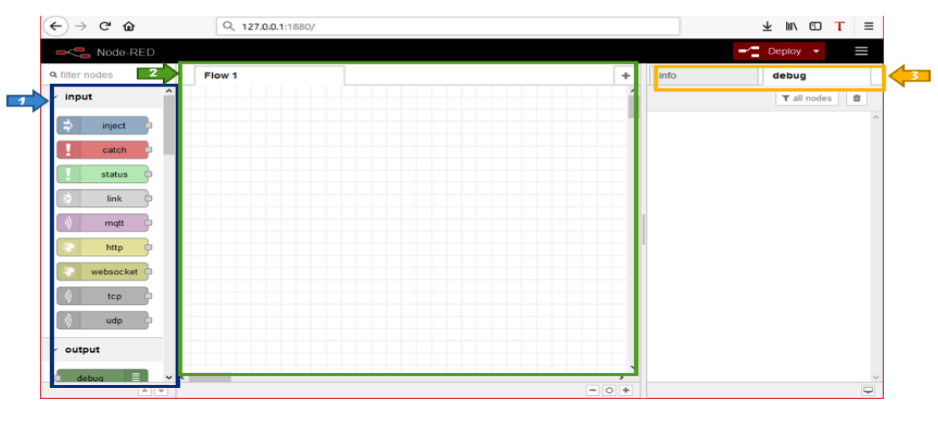
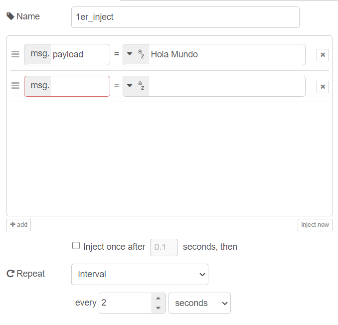
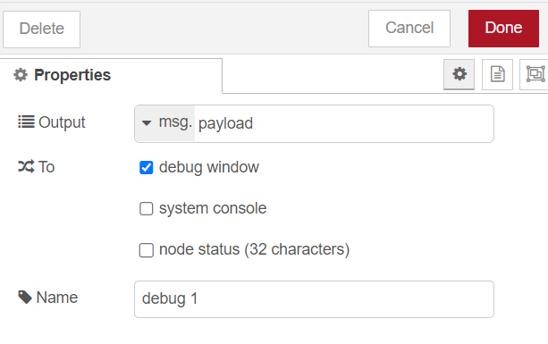
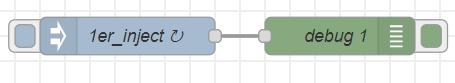
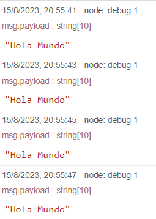

# Clase 6
## TI

### Instalación de Node-RED
Node-RED es una herramienta de desarrollo basada en flujo para programación visual desarrollada originalmente por IBM para conectar dispositivos de hardware, API y servicios en línea como parte de la Internet de las cosas.

<footer class="blockquote-footer"><a href="https://es.wikipedia.org/wiki/Node-RED">Wikipedia</a></footer>

Para el trabajo independiente de esta semana, instalaran node red y se realizaran varios ejercicios basicos para el entendimiento de esta herramienta.

1. Primer paso para la instalación.

Ingresando a Node.js, descarga la última versión de Node.js a través del siguiente link:
[Node.js](https://nodejs.org/es/download)

Recuerda instalar la opción adecuada para tu sistema operativo.

2. Segundo paso para la instalación.

Ejecuta el archivo descargado (instalador).
Para la instalación se requiere serr el administrador local, en caso de que no lo seas se solicitará una contraseña de administrador.

3. Tercer paso para la instalación.

Con el Node.js instalado, se abre el terminal del computador con las teclas windows + R (en Windows), CMD, aceptar; en Mac se abre con la aplicación terminal.

4. Cuarto paso para la instalación.

Copia y pega el siguiente comando: **npm install -g --unsafe-perm node-red node-red-admin** en el terminal abierto en el paso anterior.

5. Quinto paso para la instalación.

Una vez termine la instalación escribe el siguiente comando: **node-red** en el terminal.

Inmediatamente se ejecutara Node-Red.

**Nota:** No cierres el terminal mientras haces uso de Node-RED.

6. Sexto paso para la instalación.

Puedes abrir node red desde el terminal dando click sobre la ruta o ir al navegador y pegar en el buscador la siguiente dirección:  http://127.0.0.1:1880 y se abrira el interfaz principal de Node-RED.

### Entorno de Desarrollo Node-RED

En Node-Red, simplemente se conectan los nodos de entrada, salida y función para crear flujos y de esta manera procesar datos, controlar cosas o enviar alertas. La principal ventaja de Node-Red es que es una herramienta de código abierto para crear aplicaciones de IoT simplificando el componente de programación. A diferencia de la programación escrita, Node Red utiliza la programación visual-gráfica que permite conectar bloques de código, conocidos como nodos, para realizar tareas específicas.

#### Características de Node-RED
La interfaz de Node-Red está dividida en tres secciones principales: el Panel de Nodos (1), el Panel de Hojas (2) y el Panel de Info y Debug (3). 

Node-Red viene con una sección de nodos básicos configurados de fábrica. Dichos nodos están organizados por categorías. Las categorías incluyen "entrada", "salida", "función", "social", "almacenamiento" y otros que se instalan de acuerdo con la aplicación a desarrollar. 

El **panel de hojas** (2) es el espacio de trabajo. Basta con seleccionar, arrastrar y soltar el nodo desde el **Panel de Nodos** (1) al **Panel de Hojas** (2). 

El Panel de información y depuración (3) contiene dos pestañas, "info" y "debug". La pestaña de **info** proporciona información acerca de cómo utilizar el nodo seleccionado; dicha información muestra cómo funciona ese nodo y le brinda características sobre el tipo, propiedades, uso y configuración requerida para el nodo. 

La pestaña **debug** proporciona información sobre el resultado obtenido de un proceso de un flujo de nodos. Para imprimir en la consola de depuración debe tener un nodo de depuración en el Panel de hojas (2). En algunos casos, cuando los nodos necesitan mostrar mensajes de error, se imprimen en esta pestaña (3).

#### Aspectos de Node-RED

Para ver otros aspectos de node-red, recomendamos leer el siguiente texto realizado por la Universidad del Rosario.

<iframe src="../../img/Aspectos_generalales_Node_Red.pdf" frameborder="0" width="100%" height="600px"></iframe>

### Nodos principales de Node-RED

Como se pudieran dar cuenta la clase anterior Node-Red es una interfaz de programación de tipo “Drag an Drop” lo que permite crear soluciones IoT de manera rápida y segura, ya que permite la interacción con el usuario mediante una interfaz gráfica fácil e intuitiva de utilizar y a su vez permite la fácil interacción de esta con el hardware, ya sean sensores o actuadores. Por lo que en este trabajo independiente se dará una descripción detallada de los nodos de entrada de función y salida más utilizados en Node-Red.
Leer el texto a continuación, realizado por la Universidad del Rosario:

<iframe src="../../img/Nodos de Node RED.pdf" frameborder="0" width="100%" height="600px"></iframe>

### Hola mundo

Para el primer programa en Node-Red, lograremos que el programa diga "Hola Mundo". Abrá node-Red y desde la interfaz siga los pasos:

1. Arrastar un nodo *Inject* y un nodo *Debug* al workspace, al dar doble click sobre el nodo este se abre.

2. Cambiar la configuración del nodo **inject** de *payload* a *string*, escribir el mensaje "Hola Mundo" y asignar un valor de tiempo de 2 segundos para este caso y guardar los cambios.

    

3. En la configuración del nodo **Debug**, verificar que la opción OUTPUT se encuentre digitado payload.

    

4. Crear una conexión entre los dos nodos, crear un flujo y luego dar al boton deploy. El "Hola Mundo" debería aparecer en el Debug cada dos segundos.
    

    
    

## TD

Primera apliación en Node-RED