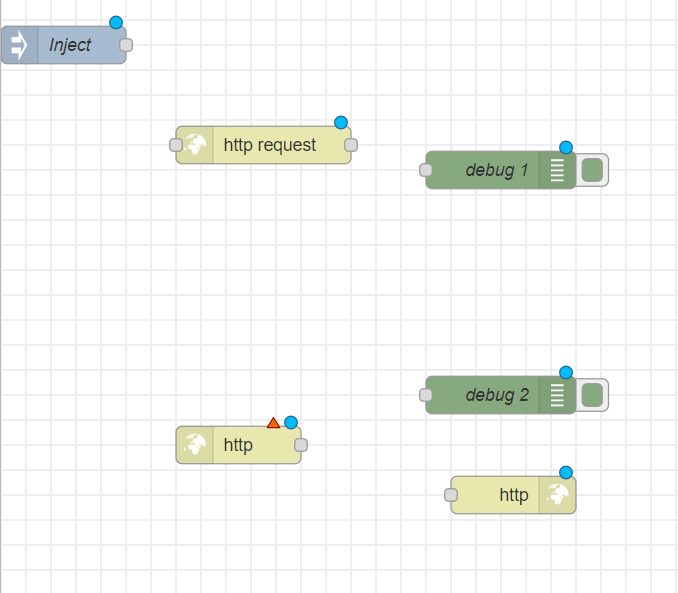
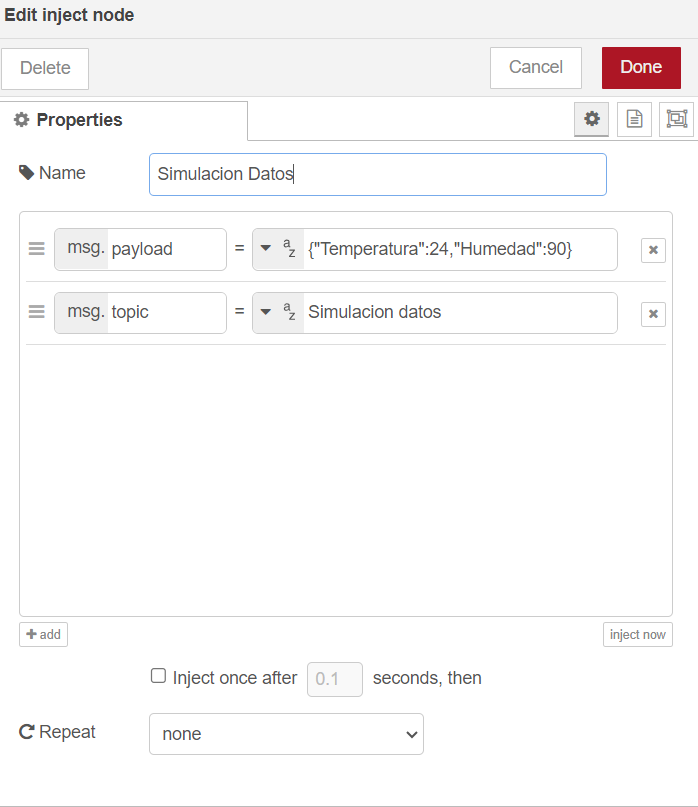
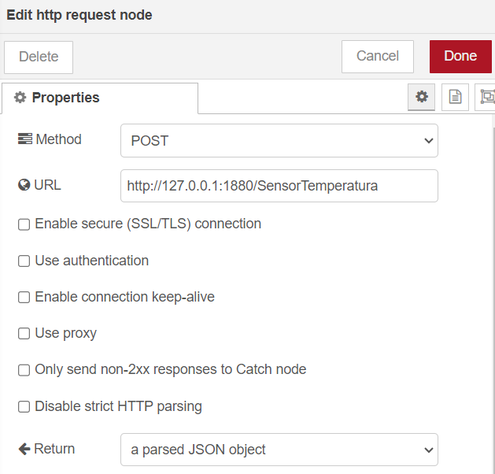
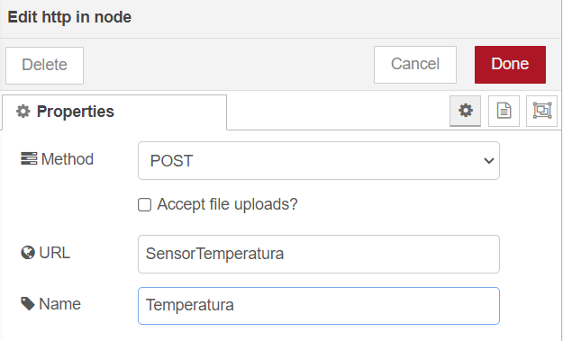
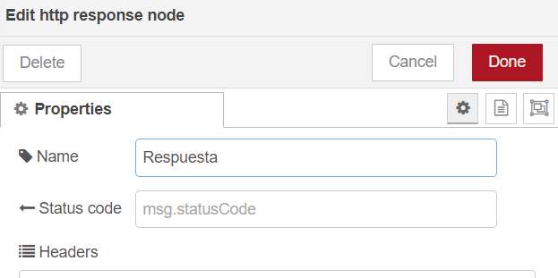
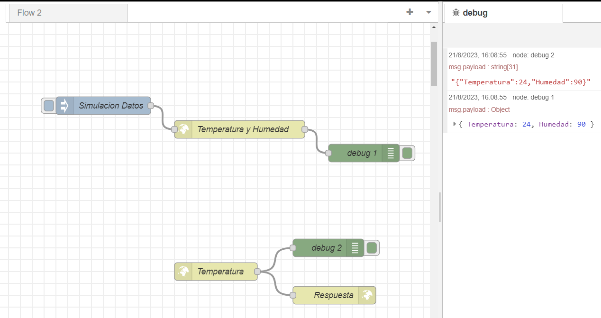

# Clase 8
## TI

### Protocolo HTTP 
El Protocolo de Transferencia de HiperTexto (Hypertext Transfer Protocol) es un sencillo protocolo cliente-servidor que articula los intercambios de información entre los clientes Web y los servidores HTTP. HTTP se basa en sencillas operaciones de solicitud/respuesta. Un cliente establece una conexión con un servidor y envía un mensaje con los datos de la solicitud. El servidor responde con un mensaje similar, que contiene el estado de la operación y su posible resultado. Todas las operaciones pueden adjuntar un objeto o recurso sobre el que actúan; cada objeto Web (documento HTML, fichero multimedia o aplicación CGI) es conocido por su URL.

En otras palabras, el protocolo HTTP permite realizar una petición de datos y recursos principalmente a la web, donde su estructura está basada en cliente-servidor. Esto quiere decir que una petición de datos es iniciada por el elemento que, después de unos segundos, recibirá los datos (el cliente).

La arquitectura de clientes y servidores se comunica intercambiando mensajes individuales (diferente a las comunicaciones, las cuales utilizan flujos continuos de datos). Los mensajes que envía el cliente, normalmente un navegador web, se llaman peticiones, y los mensajes enviados como respuesta por el servidor se llaman respuestas.

Cada vez que un cliente realiza una petición a un servidor, se ejecutan los siguientes pasos:

- Un usuario accede a una URL, seleccionando un enlace de un documento HTML o introduciéndola directamente en el campo Location del cliente Web.
- El cliente Web descodifica la URL, separando sus diferentes partes. Así identifica el protocolo de acceso, la dirección DNS o IP del servidor, el posible puerto opcional (el valor por defecto es 80) y el objeto requerido del servidor.
- Se abre una conexión TCP/IP con el servidor, llamando al puerto TCP correspondiente.
- Se realiza la petición. Para ello, se envía el comando necesario (GET, POST, HEAD,…), la dirección del objeto requerido (el contenido de la URL que sigue a la dirección del servidor), la versión del protocolo HTTP empleada (casi siempre HTTP/1.0) y un conjunto variable de información, que incluye datos sobre las capacidades del buscador, datos opcionales para el servidor, entre otros.
- El servidor devuelve la respuesta al cliente. Consiste en un código de estado y el tipo de dato MIME (Multipurpose Internet Mail Extensions) de la información de retorno, seguido de la propia información.
- Se cierra la conexión TCP.

Vamos a ponerlo en practica, abre  Node-Red y sigue los paso a continuación:

1. Arrastrá al workspace un nodo **inject**, uno **http in**, uno **http response**, dos nodos **debug** y un nodo **http request**.

    

2. En el nodo *inject*, en la propiedad payload seleccionar la variable *string* donde se escribira un dato bajo el formato json, de tal manera que simularemos la temperatura y humedad del medio ambiente. Hacer click en Done.

    

3. En el nodo *HTTP Request*: en la propiedad "Method," seleccionar POST; en el URL, escribir http://127.0.0.1:1880/SensorTemperatura, que es la dirección a la cual se enviarán los datos. En "Return," seleccionar la tercera opción, dado el formato con el cual se enviaron previamente. Dar el nombre y terminar.

    

4. En los nodos *debug*, no se necesita configuración.

5. En el nodo *HTTP In*: en la sección de propiedades, para "Method," seleccionar POST; en URL, se escribe el tópico o tema del cual se va a recibir la información, en este caso, es "SensorTemperatura". Dar nombre y terminar.

    

6. En el nodo HTTP Response, en la sección de propiedades, únicamente se modifica la etiqueta de nombre.

    

7. Si todo esta bien configurado debe quedar de la siguiente manera:

    

## TD 
1. Resolver las dudas que tenga el grupo sobre HTTP
2. Realizar la siguiente practica acompañados del profesor
    - Se necesita los siguientes componentes:
        - Tarjeta ESP8266 o equivalente
        - FTDI de programación (muchas veces ya esta incorporado en la ESP8266)
        - Sensor de temperatura
    - Conectar el sensor de temperatura a la tarjeta ESP8266.
    - Instalar en Arduino la placa ESP8266
        - En la interfaz de Arduino vaya al *menú de archivo* y dé clic en la pestaña de preferencias
        - En preferencias ir a la opción de *Gestor de URLs Adicionales de Tarjetas* e ingresar el siguiente URL **http://arduino.esp8266.com/stable/package_esp8266com_index.json** y dar clic en ok.
        - En el menú de herramientas, en la opción de seleccionar placa, ir al gestor de tarjetas
        - En el Gestor de tarjetas digite esp8266 en el cuadro de texto tipo y luego haga clic en la opción de acuerdo a la tarjeta a usar; seguido haga clic en el botón instalar o en su defecto en actualizar. A continuación, espere que se instale el paquete de placas, esto puede tardar unos minutos, por favor espere a que se instale por completo.
        - Ahora en el menú de herramientas deberia aparecer las placas ESP8266.
    - Codigo de Arduino
    - Cargar el codigo a la tarjeta
    - Desarrollo del Node-RED
    - Darle candela