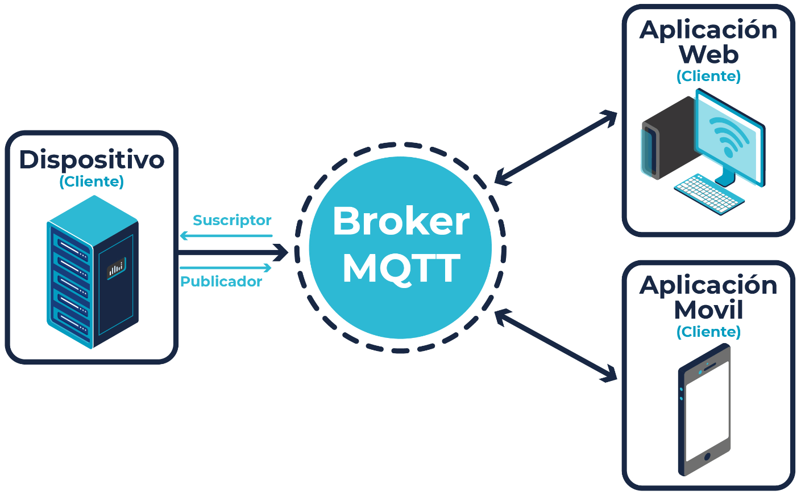
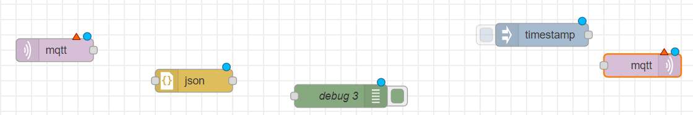
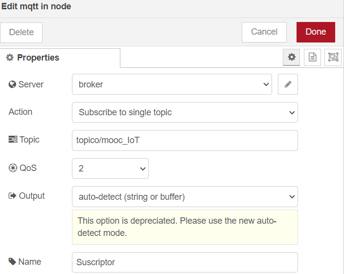
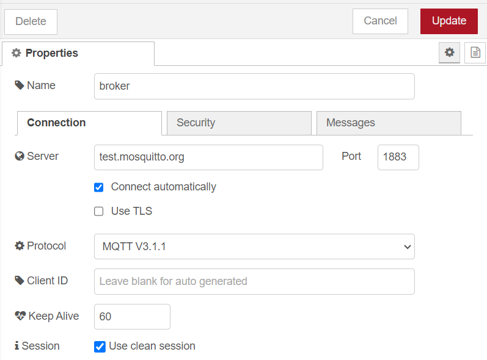
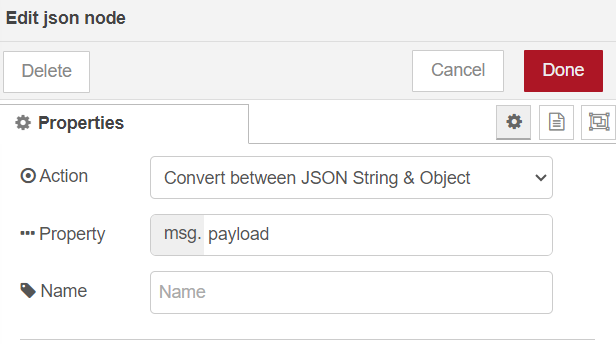
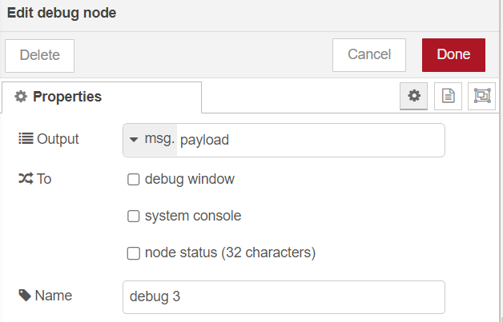
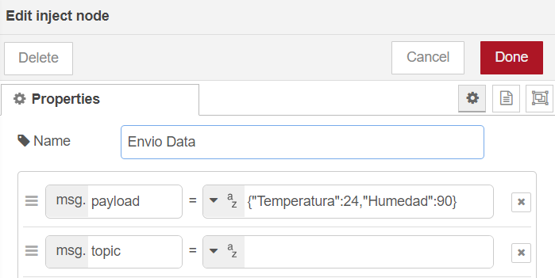
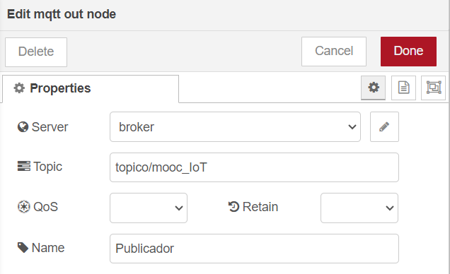
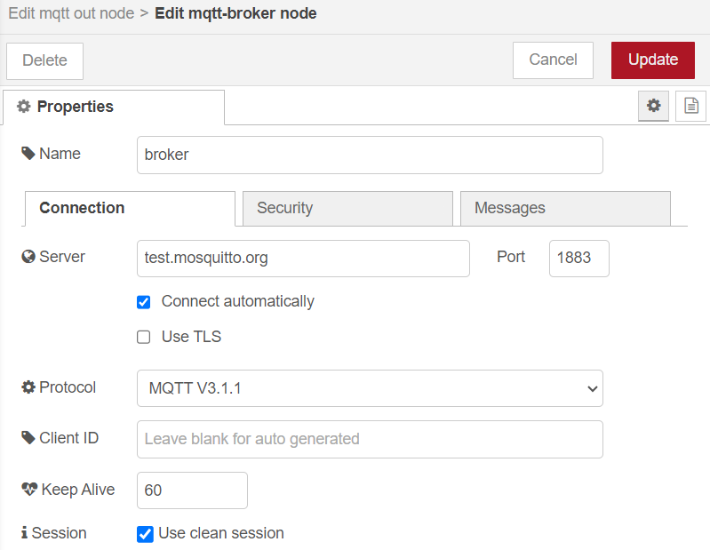
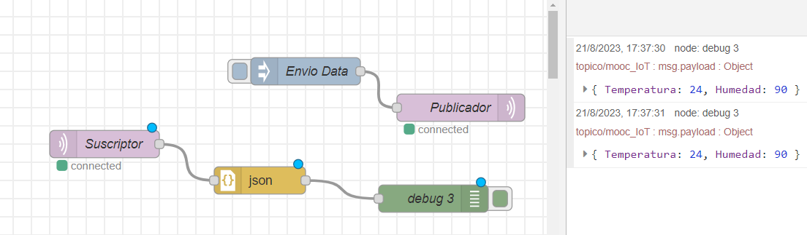

# Clase 9
## TI 

### Protocolo MQTT

Inicialmente, MQTT fue inventado y desarrollado por IBM a finales de los 90. Tal como sugiere su nombre, se trata de un protocolo de mensajería con soporte para la comunicación asíncrona entre el emisor y el receptor del mensaje, tanto en el tiempo como en el espacio.
MQTT es un protocolo de red liviano y flexible que ofrece grandes ventajas para los desarrolladores de IoT, tales como:

1. Está basado en el paradigma cliente/servidor.

2. Protocolo basado en TCP.

3. Es un protocolo estándar para IoT.

4. Conectividad M2M (Máquina a Máquina).

5. Basado en un protocolo de mensajería publicación/suscripción.

6. Hace parte de los estándares OASIS.

7. Es de licencia libre.

La configuración del protocolo MQTT contempla dos tipos de entidades en la red: se trata de un bróker de mensajería y numerosos clientes. El bróker hace las veces de un servidor, el cual recibe todos los mensajes de los clientes y, en consecuencia, direcciona estos mensajes hacia los clientes de destino programados. Un cliente es cualquier "cosa" que pueda interactuar con el bróker y recibir mensajes. Un cliente inicialmente puede ser considerado como un sensor, dispositivo o aplicación.

Es clave resaltar que dentro de la arquitectura de MQTT, el concepto de "tópico" o "tema" juega un papel fundamental, ya que a través de estos llamados "tópicos" se genera la comunicación entre los emisores y receptores de un mensaje que previamente se hayan suscrito a un "tópico" en común, con el objetivo de establecer la comunicación internamente entre ellos.

La metodología que se utiliza es la de publicador/suscriptor, la cual permite el envío de mensajes entre generadores de información (publicadores) y receptores de la información (suscriptores). Esto se logra a través de un bróker, que actúa como fuente principal para el flujo de la información entre publicadores y suscriptores que comparten la información mediante mensajes, de acuerdo con una configuración previa. En la mayoría de los casos, la configuración se fundamenta en tópicos o temas.

En ese sentido, un cliente se conecta al bróker y, a su vez, puede suscribirse a cualquier "tema" o "tópico" de mensajería del bróker. De esta manera:

(a) El cliente publica los mensajes en un tema o tópico, enviando el mensaje y el tema al bróker.

(b) Después, el bróker remite el mensaje a todos los clientes que se suscriben a este tema o tópico. Como los mensajes de MQTT se organizan por temas o tópicos, en una aplicación de IoT se puede especificar que determinados clientes pueden interactuar con mensajes específicos. Por ejemplo, un sensor de temperatura publicará el valor bajo el tema o tópico "sensor temp" y se suscribirán al tema "supervisión temp".

#### Ejercicio en Node-Red

Para hacerse una idea de como trabajar con este protocolo, se plantea el siguiente ejercicio en Node-Red:

1. Arrastrar un nodo **MQTT in**, un nodo **Inject**, uno **MQTT OUT**, un nodo **Debug** y un nodo **json**.

    

2. En el nodo *MQTT in*, en propiedades en la opción **server** seleccionar broker; en **Topic** se elige el nombre deaseado, que para este caso sería tipoco/mooc_IoT; en name se recomienda poner algo alusivo a la acción (ejemplo: suscriptor).

    

3. Se hace click en el lapicito al lado de donde se puso el server, se abrira una pestaña donde se organiza la información del broker del paso anterior. En el server se colocara test.mosquitto.org el cual permite conectarse con un servidor en la nube para gestionar los mensajes enviados.

    

4. En el nodo *json*, en la opción **Action** de la sección de propiedades, se debe seleccionar *Convert betweeen JSON string & Object.

    

5. En el nodo *debug*, en la propiedad de Output seleccionar la opción **payload**

    
    
6. En el nodo *inject*, en la propiedad payload se debe ingresar la información que se va a enviar en formato JSON {"Temperatura":24,"Humedad":90}. Darle un nombre alusivo a la acción como por ejemplo "Envio de datos".

    

7. En el nodo *MQTT out*, en el server seleccionamos el broker, en topico se colaca, el topico que se ingreso en el *MQTT in*, topico/mooc_IoT; se le asigana el nombre de publicador en este caso.

    

8. Dando en el lapicito al lado del server, se debe confirmar que la información del broker este correcta (nombre y server del broker).

    

9. Conectar los flujos y si todo queda bien, debe ver así:

    

## TD
Hacer uso de la maqueta (Mini Ciudad) para realizar una practica de MQTT donde los estudiantes logren afianzar de forma practica los conceptos